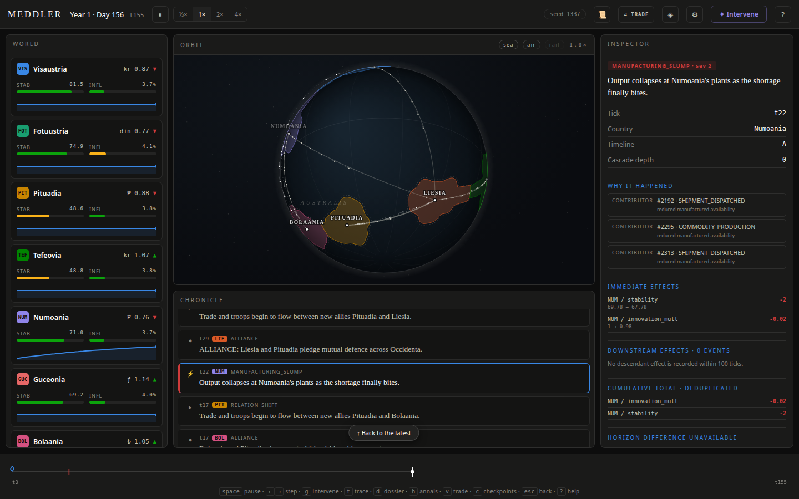
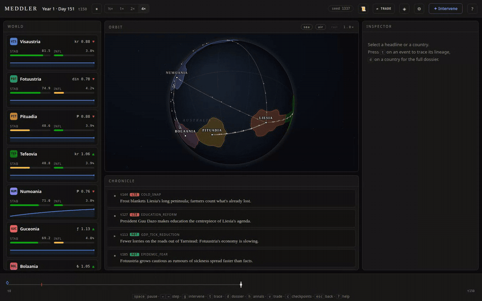

# Meddler

**A zero-player world simulator you can rewind, fork, and meddle with. It works like a
time-travel debugger for a history that runs itself.**

Fictional countries trade, elect, borrow, starve, ally, go to war, get occupied, and recover. None
of it is scripted. Every headline sits in a causal graph the engine actually computed, so you can
click one and see what caused it and everything it went on to cause. Then rewind to before it
happened, drop in a drought or an assassination, and watch the two histories diverge side by side.
Because the fork keeps the original's dice, every difference on screen is yours.



**[Try it in your browser](https://privatepanda.co/projects/meddler/demo/)**: the real Python engine, running in the page. Nothing to
install; the first load takes a moment.

## Run it locally

Python 3.11 or newer.

```sh
pip install -e .
meddler serve --open          # seed 1337 by default; --seed N for another world
```

One process serves the app and the engine on `http://127.0.0.1:7677/`, and `--open` points your
browser at it. The world starts running as soon as the page loads. Same seed, same world, same
history, every time.

No browser needed for the headless version:

```sh
meddler run --headless --seed 1337 --ticks 1000    # one headline per line, deterministic
```

## The tour



1. **Watch.** Headlines arrive on the front page, meters move, and ships, planes and trains cross
   the globe. Every one of them is a real shipment in the simulation.
2. **Ask why.** Click a headline to inspect its causes, its immediate effects, and everything
   downstream, totalled without double-counting. Press **`t`** for the whole causal graph.
3. **Rewind.** Drag the timeline ribbon or press **`←`** (**`Shift+←`** for 25 ticks). What you see
   is the world as it was at that tick, rebuilt from the record, not re-simulated.
4. **Meddle.** Press **`g`** for the intervention palette: droughts, plagues, meteor strikes,
   money printing, assassinations, blockades, blackouts. Apply one now or at any past tick, and
   the timeline forks. The ΔWORLD strip shows exactly what your change altered.
5. **Compare and choose.** Run up to three forks at once, and adopt one (**★**) as the new
   reality.
6. **Dig in.** **`d`** opens a country's dossier: full-history charts, with hover that reports
   the events in each interval and never guesses at a cause. **`h`** opens the Annals (eras,
   wars, records, and a ranking of the most consequential events). **`v`** opens Trade Operations,
   where every shipment in transit can be followed. **`?`** lists every key.

The settings panel (**⚙**) changes the rules of the world while it runs: secession, conquest,
nukes, how dramatic the world is, and how far consequences cascade.

## How it works

```
 browser  ── canvas globe, broadsheet feed, inspectors      (plain JS, no build step)
    │
    │  JSON over one WebSocket
    ▼
 bridge   ── owns the running world and the clock; translates state into messages
    │
    ▼
 engine   ── 17 systems in a fixed order, one random stream, an event log that is
             the only way anything changes
```

The engine never reads the clock or touches the network, and an import contract enforces that
layering in CI. Every change to the world, whether a transfer between treasuries, a point of
stability, a declared war, or a ship leaving port, is an event that records exactly what it
changed. Three things follow from that one rule:

- **Determinism.** Same seed, byte-identical event log. A golden-master test pins a 1000-tick run
  and fails on a single byte of drift.
- **Rewind without re-running.** Any past tick is rebuilt from the nearest snapshot plus the
  recorded changes since. No system runs and no dice are rolled, so the past cannot drift.
- **Honest counterfactuals.** A fork restores the original timeline's exact random state. With no
  intervention, it tracks the original bit for bit forever. With one, every divergence traces back
  to what you did.

Under that sits a real economy. There are six commodities and bilateral trade that conserves
money, with shipments that take time and can be sunk in a war zone. Infrastructure costs upkeep,
decays, and throttles freight. Alliances pull members into wars, and occupiers take tribute.
The event catalog has 123 kinds. Long histories live in a per-run SQLite file, so memory stays
flat over thousands of ticks.

The full tour is in [docs/architecture.md](docs/architecture.md).

## Documentation

- [Architecture](docs/architecture.md): the layers, the tick loop, events, causality, replay,
  forks, storage, and the determinism rules.
- [Devlog](docs/devlog.md): how it was built, and the bugs that taught the most.
- [Design decisions](docs/design-decisions.md): every non-obvious call, with the measurement
  that settled it.
- [Frontend contract](docs/frontend-contract.md): the engine-to-browser protocol.
- [Design guide](docs/design-guide.md): the visual system for anything in `web/`.
- [Demo script](docs/demo.md): a 60-second walkthrough.
- [Original design](PROPOSAL.md), the [v1 build plan](docs/design/implementation-spec.md), the
  [v2 design](docs/design/v2-simulation-driven-world.md), and the
  [engineering log](docs/progress.md).

## Development

```sh
pip install -e ".[dev]"
pytest              # unit, property, golden-master, and bridge tests
ruff check .
mypy meddler/engine # strict
lint-imports        # the layering contract
```

See [CONTRIBUTING.md](CONTRIBUTING.md) for the faster test subset and the rules that keep the
golden master stable.

## Limits, stated plainly

- The world is fictional and deliberately legible rather than realistic.
- Each country settles toward a stability of its own rather than a shared ceiling, so the map
  reads as nations with different temperaments. What moves a country off its own level is
  events -- so a nation that wars, coups and shortages all happen to miss can sit almost
  unchanged for a long stretch, and in a quiet world more than one of them can.
- History lives for one server run. There is no save/load across restarts yet.
- Most interventions are declarative: stat and pool changes that cascade. War, peace, alliance,
  embargo, the infrastructure interventions and secession are structural -- they change who is
  at war, who is allied, what is blockaded, and, for secession, who exists. No country is ever
  born on its own: separatist crises flare without your help, but only a secession you cause
  actually puts a new state on the map.
- A traced headline is the event described in the world's present terms, not a quotation of the
  wording the feed carried at the time. The causal structure behind it -- the events, their
  links, their ticks and their recorded effects -- is exact either way.
- The speed control is a request, not a guarantee. On a lightly loaded machine a tick of the
  reference world costs roughly 60-200 ms through tick 1000, inside the 250 ms that 4x allows --
  though individual ticks run over. On a busy machine every tick can cost twice as much and 4x
  falls behind. When the clock falls behind nothing is lost or skipped; the
  simulation is identical, it just advances less often.
- Territory shapes and satellite orbit paths on the globe are drawn for legibility. The
  positions, owners, counts and conditions behind them come from the engine.

## License

Meddler is free software under the [GNU Affero General Public License v3.0 or later](LICENSE).
Use it, study it, change it, and share it. If you distribute it, or run a modified version
where other people can use it over a network, section 13 obliges you to offer those users the
complete source of your version under the same license, and to keep the copyright notice.

Copyright (C) 2026 Parth Mittal. The author holds the copyright and can license the project
separately on other terms; ask if you need that.

Built by [Parth Mittal](https://privatepanda.co).
